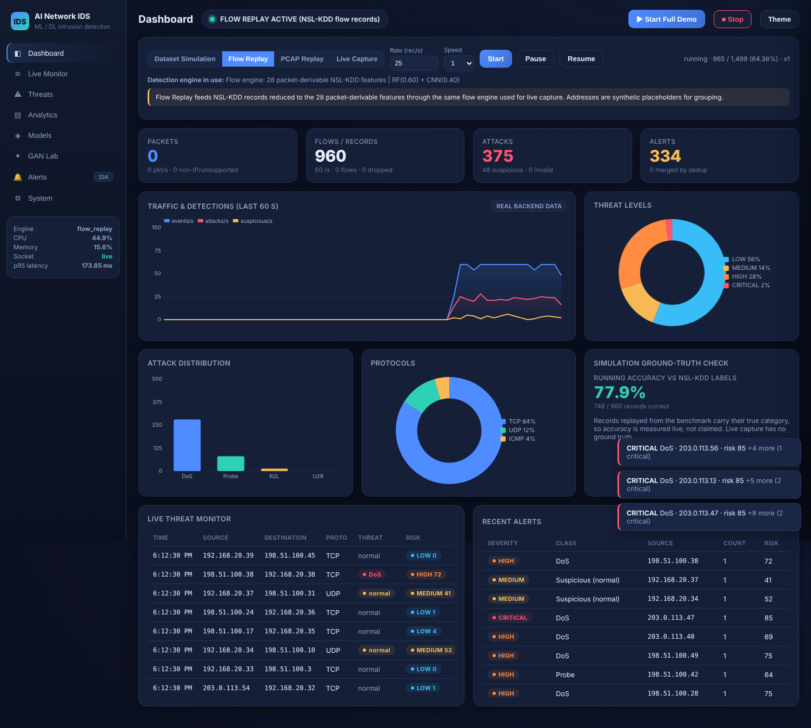
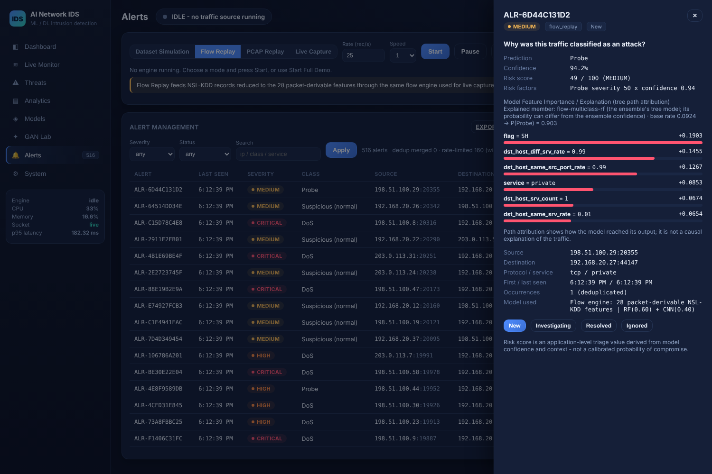
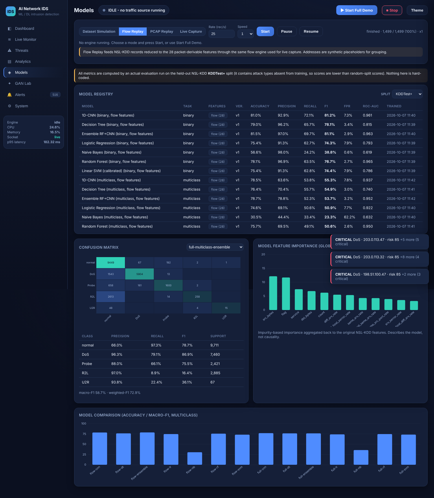
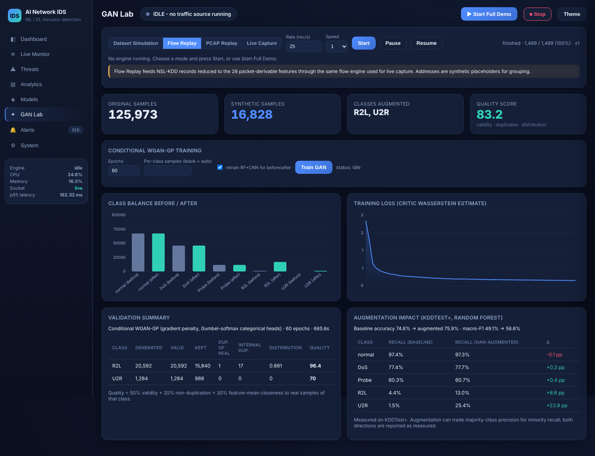
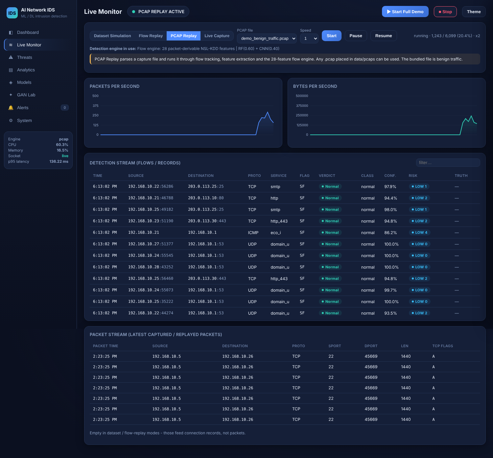

[](https://github.com/saloni-29-01/AI-Based-Network-IDS_ML-DL)
[](https://doi.org/10.5281/zenodo.17488850)

# AI-Based Network Intrusion Detection System (ML / DL)

An integrated network intrusion detection system: NSL-KDD binary and multiclass
detection with classical ML and a 1D-CNN, GAN-based minority-class
augmentation, flow-based live/PCAP detection, an ensemble + risk engine,
de-duplicated alerting, SQLite persistence, a FastAPI backend with WebSocket
streaming, and a SOC-style dashboard.

**Author:** [Saloni Kumari](https://github.com/saloni-29-01) · B.Tech Computer Science & IT, C. V. Raman Global University, Bhubaneswar · Repository: [github.com/saloni-29-01/AI-Based-Network-IDS_ML-DL](https://github.com/saloni-29-01/AI-Based-Network-IDS_ML-DL)



## Contents
[Overview](#project-overview) · [Problem](#problem-statement) · [Objectives](#objectives) · [Architecture](#architecture) · [Technologies](#technologies) · [Dataset](#dataset) · [Models](#mldl-models) · [GAN](#gan-data-augmentation) · [Live detection](#live-detection) · [PCAP replay](#pcap-replay) · [Dashboard](#dashboard) · [API](#api) · [Installation](#installation) · [Windows setup](#windows-setup) · [Npcap](#npcap-setup) · [Training](#model-training) · [Running](#running-the-dashboard) · [Testing](#testing) · [Troubleshooting](#troubleshooting) · [Limitations](#limitations) · [Future scope](#future-scope) · [Academic contribution](#academic-contribution) · [Credits](#credits)

## Project overview

The system has four traffic sources that all feed one detection pipeline:

| Mode | What it processes | Engine |
|---|---|---|
| **Dataset Simulation** | genuine NSL-KDD KDDTest+ records, one by one | 41-feature NSL-KDD engine |
| **Flow Replay** | NSL-KDD records reduced to the 28 packet-derivable features | flow engine |
| **PCAP Replay** | any capture file, parsed into flows | flow engine |
| **Live Monitoring** | real packets from a network interface | flow engine |

The dashboard always shows which mode and which engine are active
(`DATASET SIMULATION ACTIVE`, `PCAP REPLAY ACTIVE`, ...). Benchmark records
are never presented as live traffic.

## Problem statement

Signature-based IDSs miss novel attacks, and many ML-based IDS projects stop
at a notebook that scores a benchmark. Such projects often (a) report
inflated accuracy from random splits of the training file, (b) cannot run
on real traffic because benchmark features are not computable from packets,
and (c) ignore severe class imbalance (U2R has 52 training rows). This
project builds a working detection system and keeps these limitations visible.

## Objectives

1. Binary and multiclass intrusion detection with honest evaluation on the official test split.
2. A deep-learning model (1D-CNN) and a calibrated ensemble with classical ML.
3. GAN-based augmentation of minority attack classes, with validation of the synthetic data.
4. Real-time monitoring: packet capture, flow aggregation and NSL-KDD-style feature extraction.
5. Risk scoring, de-duplicated alerting and explainable detections.
6. A dashboard, API and persistence layer suitable for demonstration and extension.

## Architecture

```
 Live capture ─┐                                       ┌─ full engine (41 features) ─┐
 PCAP replay  ─┼─► FlowTracker ─► FeatureExtractor ─┐  │  RF + 1D-CNN ensemble       │
               │                                    ├─►│                             ├─► Risk ─► Alerts ─► SQLite
 Flow replay  ──────────────────────────────────────┤  │  flow engine (28 features)  │      │
 Dataset sim  ──────────────────────────────────────┘  └─ RF + 1D-CNN ensemble ──────┘      ▼
                                                                         LiveStats ─► WebSocket ─► Dashboard
```

Full diagrams (component, ML, GAN, packet, database, API, frontend, deployment): **[docs/ARCHITECTURE.md](docs/ARCHITECTURE.md)**.

```
app/
  main.py, config.py            FastAPI app + .env configuration
  api/        routes.py, websocket.py, schemas.py
  capture/    packet.py, flow_tracker.py, pcap_reader.py, packet_capture.py,
              flow_replay.py, dataset_sim.py, base.py
  features/   schema.py, flow_features.py, services.py, validators.py
  preprocessing/ dataset.py, pipeline.py
  models/     classical.py, cnn.py, ensemble.py, trainer.py, evaluation.py,
              explain.py, model_registry.py
  gan/        tabular_wgan.py, validation.py, augment.py
  detection/  detector.py, risk_engine.py
  alerts/     alert_manager.py, notifications.py
  storage/    database.py, repositories.py
  monitoring/ metrics.py, drift.py, health.py
  core/       engine.py          (wires everything together)
  reporting/  report.py
frontend/     index.html, css/app.css, js/app.js, js/charts.js
scripts/      train_models.py, train_gan.py, build_flow_replay.py,
              generate_demo_pcap.py, export_results.py, api_call.py
tests/        54 tests: unit, integration, API, WebSocket, GUI smoke, GAN, capture, broadcast
docs/         ARCHITECTURE.md, AUDIT.md, RESULTS.md, IMPLEMENTATION_STATUS.md
nsl-kdd/      dataset (unchanged)
BinaryPrediction.ipynb, MulticlassPrediction.ipynb, script.py   (original work, preserved)
```

## Technologies

| Purpose | Choice | Why |
|---|---|---|
| Classical ML | scikit-learn | the original project's models |
| Deep learning + GAN | TensorFlow / Keras 3 | already used by the notebooks; Python 3.12 and Windows CPU wheels |
| Backend | FastAPI + uvicorn | async WebSocket support, Pydantic validation |
| Packet capture / PCAP | Scapy (+ Npcap on Windows) | pure-Python, same parser for live and replay |
| Storage | SQLite (stdlib `sqlite3`, WAL) | zero setup for a local demo |
| Frontend | plain JS + a small built-in canvas chart library | no Node build step and no CDN, so it works offline |

Every dependency has a reason; see `requirements.txt`. Java and Node are not needed.

## Dataset

**NSL-KDD** (in `nsl-kdd/`): KDDTrain+ 125,973 records, KDDTest+ 22,544,
KDDTest-21 11,850. 41 features per connection; labels are consolidated into
normal, DoS, Probe, R2L and U2R. KDDTest+ includes attack types that are absent
from training, which is why test accuracy is far below random-split accuracy.

Training-set class counts: normal 67,343 · DoS 45,927 · Probe 11,656 · R2L 995 · U2R 52.

## ML/DL models

Trained for both tasks (binary, multiclass) and both feature sets (41 full, 28 flow):
Logistic Regression, Gaussian Naive Bayes, Linear SVM (Platt-calibrated for
probabilities), Decision Tree, Random Forest, 1D-CNN (Conv1D 32 -> Conv1D 64 -> Dense 64),
and a soft-voting **ensemble (RF 0.6 + CNN 0.4)**. That is 28 registry entries, plus 3 GAN-augmented variants (`*-gan`) created by `train_gan.py`.

Each model has versioned metadata: training time, dataset fingerprint,
preprocessing version, feature schema, hyperparameters, and metrics on the
validation, KDDTest+ and KDDTest-21 splits.

### Headline results (KDDTest+, from `docs/RESULTS.md`)

| Engine | Task | Accuracy | F1 | False-positive rate |
|---|---|---:|---:|---:|
| Ensemble RF+CNN, full 41 features | binary | 81.09% | 80.61% | 3.01% |
| Ensemble RF+CNN, flow 28 features | binary | 81.52% | 81.11% | 2.87% |
| Ensemble RF+CNN, full 41 features | multiclass | 76.41% | 58.71% (macro) | 2.70% |
| Ensemble RF+CNN, flow 28 features | multiclass | 78.71% | 53.73% (macro) | 3.17% |
| Ensemble RF+CNN, full, **GAN-augmented** | multiclass | 80.19% | 68.83% (macro) | 2.87% |

Observations:
* KDDTest+ scores (~76–82%) are far below the ~99% that random splits of KDDTrain+ give. The test split contains unseen attack types, and these numbers match published NSL-KDD results.
* The **28-feature flow engine performs about as well as the 41-feature engine** on binary detection. Dropping the packet-invisible content features costs almost nothing on this benchmark, which supports using it for live traffic.
* Minority classes are the weak spot. Baseline ensemble recall is 8.9% for R2L and 22.4% for U2R. **GAN augmentation raised them to 26.9% and 44.8%**, with normal-traffic recall essentially unchanged (97.3% → 97.1%). For the Random Forest alone: R2L 4.4% → 13.0%, U2R 1.5% → 25.4%, macro-F1 49.1% → 58.6%.
* In the dashboard's benign PCAP test, all 572 flows were classified normal (0 false positives).

Full tables (per-class, KDDTest-21, GAN impact): **[docs/RESULTS.md](docs/RESULTS.md)**, generated by `scripts/export_results.py`.

**Explainability.** For detections from tree models, the dashboard panel *"Why was
this traffic classified as an attack?"* shows prediction, confidence, risk
factors and the top contributing features. Contributions come from **tree path
attribution** (Saabas method): the change in class probability at each split
is credited to the split feature, and `base rate + Σ contributions = predicted
probability` exactly (tested). The panel is labelled *Model Feature Importance /
Explanation*: it describes the model's reasoning, not causality. A global
impurity-based importance chart is on the Models page.

## GAN data augmentation

`app/gan/` implements a **conditional WGAN-GP** for tabular data:

* conditioned on the attack class so a specific minority class can be generated;
* numeric features are log-scaled to [-1, 1] (tanh head); protocol, service and flag each get a softmax head with Gumbel-softmax during training;
* Wasserstein loss with gradient penalty (λ = 10) and 3 critic steps per generator step, for stable training on tabular data.

Pipeline: class analysis -> minority classes (below the median count: R2L, U2R)
-> GAN training -> generation -> **validation** (negative values, NaN, rates > 1,
invalid protocol/flag, duplicates of real rows, internal duplicates,
feature-mean closeness) -> augmented *training* set -> RF + CNN retrained as
variant `gan` -> per-class recall compared on KDDTest+.

To avoid teaching the classifier GAN artefacts, synthetic volume is capped at
**min(20× the real count, 25% of the majority class)**. U2R therefore grows
from 52 to 1,040 rows, not to tens of thousands. The GAN Lab page shows class
balance before and after, the loss curve, the validation table and the measured impact.
To use the augmented models for dataset simulation, set `FULL_ENGINE_VARIANT=gan` in `.env`;
the engine label then shows `[GAN-augmented training]`.

## Live detection

NSL-KDD's 41 features cannot all be computed from packets: 13 "content"
features (`hot`, `num_failed_logins`, `logged_in`, `root_shell`, ...) need
session reassembly and application-layer parsing. Setting them to zero would
give a 41-feature model inputs it never saw in training, so this project does not do that.

Instead, a **separate flow engine** is trained on NSL-KDD using only the 28
features that *can* be measured from packet headers:

* basic: duration, protocol, service (port mapping), TCP state flag (SF/S0/REJ/RSTO/...), bytes each way, land, wrong fragments, urgent;
* time-based (connections in the last 2 s) and host-based (last 255 connections): `count`, `serror_rate`, `same_srv_rate`, `dst_host_*`, following the KDD definitions.

Pipeline: packet -> 5-tuple flow tracker (both directions, TCP state machine,
timeouts in packet time) -> feature extraction -> validation -> flow engine ->
risk -> alert -> SQLite -> WebSocket -> dashboard. The flow engine's own
KDDTest+ metrics are reported next to the full engine's, so the cost of the
reduced feature set is measured.

## PCAP replay

Any `.pcap` in `data/pcaps/` can be replayed with Start / Pause / Resume / Stop
and speed 0.5× – 10×. It runs through exactly the same code as live capture. Long idle
gaps are shortened in wall-clock time, but packet timestamps, and therefore
all features, are unchanged.

The bundled `demo_benign_traffic.pcap` is **benign** scripted traffic (web,
HTTPS, DNS, SMTP, SSH, ping) between private/documentation addresses. It
was crafted offline and never transmitted. It demonstrates the false-positive
side: in testing, all 572 flows were classified normal. To show detections on the flow engine, use
**Flow Replay**, which replays genuine NSL-KDD attack records rather than
synthesised attack traffic. You can also replay your own Wireshark captures.

## Dashboard

Pages: **Dashboard** (status, KPIs, live traffic and detection chart, threat
levels, attack and protocol distribution, ground-truth accuracy, live threat
table, recent alerts) · **Live Monitor** (pkt/s, B/s, detection stream,
packet stream) · **Threats** (filter by verdict, class, protocol, IPs, text) ·
**Analytics** (attacks over time, severity, top sources and destinations,
targeted services, distribution-shift monitor) · **Models** (registry with
per-split metrics, confusion matrix, per-class table, feature importance,
comparison) · **GAN Lab** · **Alerts** (filters, detail drawer with
explanation, status workflow New/Investigating/Resolved/Ignored, CSV export,
HTML report) · **System** (CPU, memory, DB, capture capability, engines, logs).
Dark and light themes; responsive down to phone width.

Every number comes from the backend: live counters over WebSocket, history and
metrics over REST. There are no client-side animations pretending to be data.

| | |
|---|---|
|  |  |
|  |  |

## API

| Method | Path | Purpose |
|---|---|---|
| GET | `/api/health` | liveness, TensorFlow availability, system health |
| GET | `/api/status` | mode, banner, active engine, source progress, alert stats |
| GET | `/api/stats` · `/api/series` | live counters · per-second series |
| GET | `/api/events` · `/api/events/recent` · `/api/packets/recent` | stored events (filterable) · live buffers |
| GET | `/api/alerts` · `/api/alerts/{id}` · POST `/api/alerts/{id}/status` | alert management |
| GET | `/api/threats` · `/api/drift` | threat summary · distribution-shift monitor |
| GET | `/api/models` · `/api/models/{id}` · `/api/metrics` | registry and metrics |
| POST | `/api/predict` | classify raw NSL-KDD records (`feature_set`: full / flow) |
| POST | `/api/capture/dataset/start` · `/api/flow-replay/start` · `/api/replay/start` · `/api/capture/start` | start a source |
| POST | `/api/source/stop` · `/pause` · `/resume` · `/speed` | source control |
| POST | `/api/demo/start` | one-click demo |
| GET/POST | `/api/gan/status` · `/api/gan/train` · `/api/gan/report` | GAN |
| GET | `/api/capture/capability` · `/api/system` · `/api/logs` · `/api/pcaps` | environment |
| GET | `/api/export/alerts.csv` · `/api/export/events.csv` · `/api/export/report.html` | exports |
| WS | `/ws/live` | live frames (status, stats, series, new events and alerts), 2/s |

Interactive docs: `http://127.0.0.1:8000/docs`.

## Installation

```bash
git clone https://github.com/saloni-29-01/AI-Based-Network-IDS_ML-DL.git
cd AI-Based-Network-IDS_ML-DL
python -m venv .venv
.venv\Scripts\activate            # Linux/macOS: source .venv/bin/activate
pip install -r requirements.txt
python setup.py                   # checks, folders, DB, demo data; trains models only if missing
python run.py --open              # dashboard at http://127.0.0.1:8000
```

Trained models are included in `models/`, so `setup.py` only retrains if they
are missing or cannot be loaded (for example after a scikit-learn version change).

## Windows setup

1. Install **Python 3.12** (64-bit) from python.org and tick *Add python.exe to PATH*.
2. In the project folder: `python -m venv .venv` then `.venv\Scripts\pip install -r requirements.txt`.
3. Double-click **`run_project.bat`**. It finds the venv, checks packages, models and the database, and shows:

```
1. Start Full Demo   2. Dataset Simulation   3. PCAP Replay   4. Live Monitoring
5. Train Models      6. Train GAN            7. Run Tests     8. Open Dashboard   9. Exit
```

The server opens in its own window, and the menu waits until `/api/health` answers before starting a mode.

## Npcap setup

Live monitoring only (every other mode works without it):

1. Download Npcap from <https://npcap.com> and install with **"Install Npcap in WinPcap API-compatible Mode"** ticked.
2. Start the terminal (or `run_project.bat`) **as Administrator**, unless you installed Npcap without the admin-only restriction.
3. Choose the interface in the dashboard (Live Capture -> Interface) or set `CAPTURE_INTERFACE` in `.env`.

If Npcap is missing, the System page and the Live Capture button say so; nothing crashes. Linux needs `sudo` (or `CAP_NET_RAW`), macOS needs root.

## Model training

```bash
python scripts/train_models.py                 # all 28 entries (~8 min on a 2-core CPU)
python scripts/train_models.py --no-cnn        # classical models only, no TensorFlow needed
python scripts/train_gan.py --epochs 60        # GAN + augmentation + RF/CNN retrain (~15 min)
python scripts/export_results.py               # regenerate docs/RESULTS.md
```

## Running the dashboard

`python run.py --open` (or menu option 8). **Start Full Demo** checks health,
loads the models (already in memory) and starts a dataset simulation.

### Running Dataset Simulation
Dashboard -> *Dataset Simulation* -> Start (rate and speed adjustable), or `run_project.bat` -> 2.

### Running Flow Replay
Dashboard -> *Flow Replay* -> Start. Rebuild the file with `python scripts/build_flow_replay.py`.

### Running PCAP Replay
Copy a `.pcap` to `data/pcaps/`, then Dashboard -> *PCAP Replay* -> choose file -> Start (or menu 3 for the bundled file).

### Running Live Monitoring
Install Npcap, run as Administrator, then Dashboard -> *Live Capture* -> choose interface -> Start (or menu 4).

## Testing

```bash
pip install -r requirements-dev.txt
python -m pytest
```

54 tests cover preprocessing and leakage, validators, the TCP flow state machine,
NSL-KDD traffic features, the risk engine, alert dedup and rate limiting, the
database, model loading and caching, exactness of the explanations, end-to-end
flow -> alert -> DB, dataset simulation, PCAP replay, every API endpoint group,
the WebSocket, GUI smoke checks, the GAN data path (including a regression test for the numeric-collapse bug) and live-capture duplicate-frame handling. Tests use a temporary database.

## Troubleshooting

| Symptom | Fix |
|---|---|
| `Npcap not detected` | install Npcap (see above) and restart the app |
| `Permission denied opening the capture device` | run the terminal as Administrator / with sudo |
| `model '...' is not trained` | `python scripts/train_models.py` |
| models fail to load after upgrading packages | `python setup.py --retrain` |
| CNN/GAN shown as unavailable | TensorFlow not installed or failed to import; classical models still work |
| port 8000 busy | set `APP_PORT=8010` in `.env` |
| dashboard shows *reconnecting* | the server stopped; check its window or `logs/ids.log` |

## Limitations

* **NSL-KDD is a 2009 benchmark** derived from 1998 traffic. It does not represent modern networks, protocols or attacks.
* **Live and PCAP verdicts are indicative.** The flow engine is trained on NSL-KDD-shaped flows, so modern traffic is out of domain (the drift monitor reports this). Purely content-based attacks such as password guessing cannot be seen without payload features.
* **Broadcast/multicast traffic is not scored.** On a real Wi-Fi network, discovery traffic (SSDP, mDNS, NetBIOS, DHCP) was labelled Probe because NSL-KDD has no such traffic. These flows are counted and shown on the dashboard but not classified (`SKIP_BROADCAST=true`). The directed-broadcast check assumes addresses ending in `.255`.
* **Service mapping** from port to NSL-KDD service name is approximate (unknown ports map to `private`).
* **Accuracy differs by split:** KDDTest+ includes unseen attack types; random splits of KDDTrain+ give ~99%, which is not a measure of generalisation.
* **Risk score** is an application-level triage value derived from model confidence plus simple context signals (repetition, sensitive ports, connection rate). It is not calibrated. A *Suspicious* (uncertain) verdict is capped at MEDIUM so it never outranks a confident detection.
* **GAN samples for U2R** come from only 52 real examples; quality and impact are measured and reported, not assumed.
* **Drift monitor** is a basic PSI check on the predicted-class distribution, not a full drift-detection framework.
* The API has **no authentication**; keep it on localhost or a trusted network.
* Only SQLite is implemented (PostgreSQL would need an SQLAlchemy layer).

## Future scope

Session reassembly to recover content features · training the flow engine on
modern labelled flow datasets (CIC-IDS2017, UNSW-NB15) · SHAP for the CNN ·
online/continual learning · authentication and multi-user SOC workflow · distributed sensors.

## Academic contribution

This work demonstrates: (1) AI-based intrusion detection; (2) binary and
multiclass classification evaluated on the official test split; (3) deep
learning (1D-CNN); (4) GAN-based augmentation with synthetic-data validation;
(5) real-time network monitoring; (6) flow-based feature extraction
following the KDD definitions; (7) ensemble and risk-based detection;
(8) automated, de-duplicated alerting; (9) explainable detections with exact
path attribution; (10) a security monitoring dashboard. Its main
methodological point is the explicit separation of the benchmark feature
space from the packet-derivable feature space, which keeps live detection
scientifically honest.

## Credits

### Original work: Saloni Kumari
From [saloni-29-01/AI-Based-Network-IDS_ML-DL](https://github.com/saloni-29-01)
(MIT, DOI [10.5281/zenodo.17488850](https://doi.org/10.5281/zenodo.17488850)):
the choice of NSL-KDD and the project objective; the preprocessing approach,
feature categorisation and label consolidation; the evaluated model set
(LR, NB, SVM, DT, RF, CNN) and the CNN architecture; the notebooks and
`script.py`. The original copyright notice is preserved in [`LICENSE`](LICENSE).
The 1D-CNN in `app/models/cnn.py` is refactored from his multiclass notebook.

### Modernisation, integration and new components: [Saloni Kumari](https://github.com/saloni-29-01)
* First pass (see [CHANGELOG.md](CHANGELOG.md)): Keras 3 / pandas 3 compatibility, leakage and label-alignment fixes in the notebooks.
* v2.0 (this release): repository audit ([docs/AUDIT.md](docs/AUDIT.md)); modular `app/` architecture; honest evaluation on KDDTest+/KDDTest-21; model registry with versioned metadata; the 28-feature flow engine; flow tracker and KDD-style traffic features; live capture, PCAP replay, flow replay and dataset simulation; ensemble and risk engine; tree path attribution; alert manager; SQLite storage; FastAPI + WebSocket backend; dashboard; conditional WGAN-GP augmentation with validation; drift monitor; reports and exports; Windows tooling; test suite; documentation.

### Contact
Questions, bugs and suggestions: please open an issue at <https://github.com/saloni-29-01/AI-Based-Network-IDS_ML-DL/issues>.
Security reports: see [SECURITY.md](SECURITY.md).

### Citation
If you use this integrated system (v2.0), cite this repository:

```bibtex
@software{kumari2026idsv2,
  author = {Saloni Kumari},
  title  = {AI-Based Network Intrusion Detection System (ML/DL), v2.0: integrated live IDS with GAN augmentation},
  year   = {2026},
  url    = {https://github.com/saloni-29-01/AI-Based-Network-IDS_ML-DL},
  note   = {Based on Saloni, (2026), AI-Based-Network-IDS_ML-DL, doi:10.5281/zenodo.17488850}
}
```

If you use the underlying methodology, cite the original project:

```bibtex
@software{kumari2026idsv2,
  author    = {Saloni Kumari},
  title     = {AI-Based-Network-IDS_ML-DL: Machine and Deep Learning Models for Intrusion Detection Systems},
  year      = {2026},
  publisher = {Zenodo},
  doi       = {10.5281/zenodo.17488850},
  url       = {https://github.com/saloni-29-01/AI-Based-Network-IDS_ML-DL}
}
```

Licensed under the [MIT License](LICENSE). © 2026 Saloni Kumari (original work), © 2026 Saloni Kumari (v2.0).
