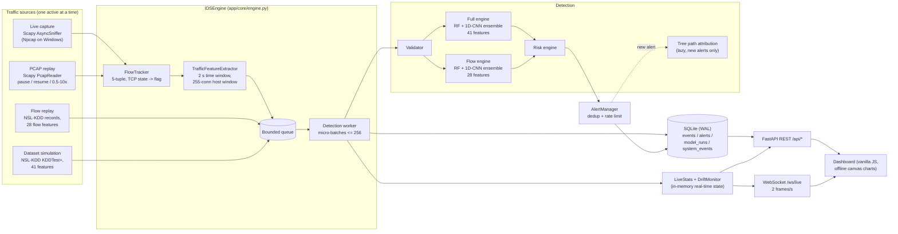
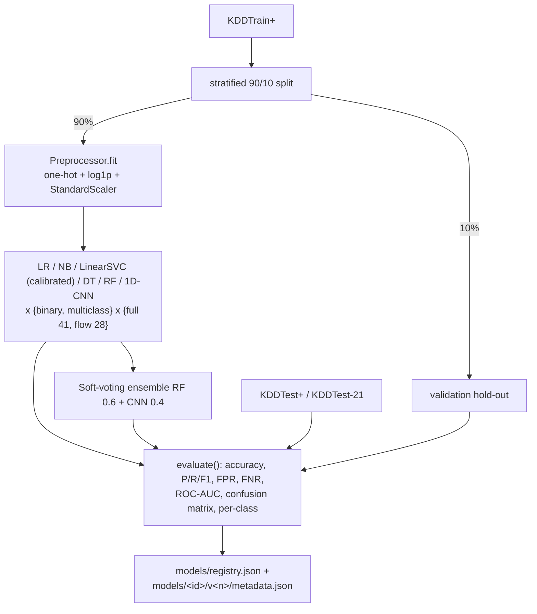
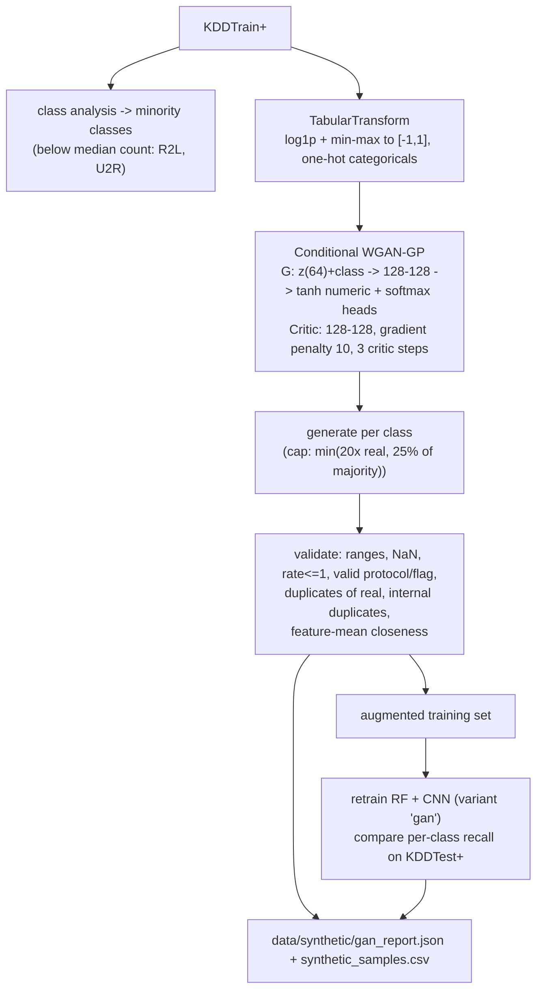

# Architecture

## 1. Component diagram

## 2. Data flow per mode

| Mode | Input | Feature set | Engine | Ground truth |
|---|---|---|---|---|
| Dataset Simulation | KDDTest+ rows | 41 NSL-KDD features | full | yes (NSL-KDD label) |
| Flow Replay | NSL-KDD rows reduced to 28 features (JSONL) | 28 flow features | flow | yes |
| PCAP Replay | any `.pcap` | flows -> 28 features | flow | no |
| Live Capture | packets from a NIC | flows -> 28 features | flow | no |

Live and PCAP detection run on **exactly the same code path**: packet ->
`PacketInfo` -> `FlowTracker` -> `TrafficFeatureExtractor` -> queue.

## 3. ML pipeline

* The preprocessor is pickled next to each model, so inference uses exactly the transformation it was trained with.
* `ModelManager` loads each model once and keeps it in memory.
* Versioning: every retrain creates `v<n+1>` and makes it active; earlier versions remain on disk.

## 4. GAN pipeline

Synthetic samples are added to **training data only**; the test split is untouched.

## 5. Live packet pipeline

1. `from_scapy()` converts a frame to `PacketInfo` (non-IP frames are counted as unsupported).
2. `FlowTracker` matches both directions of a 5-tuple (ICMP keyed by echo id), tracks
   packets/bytes per direction, URG and fragment anomalies, and TCP state.
3. A flow finishes on RST, on FIN from both sides (+1 s grace), on idle timeout
   (TCP 10 s / UDP 5 s / ICMP 2 s) or the 120 s active timeout. Timing uses packet
   timestamps, so PCAP replay at any speed yields identical flows.
4. `TrafficFeatureExtractor` computes NSL-KDD time-based (2 s) and host-based
   (last 255 connections) features from connection start times.
5. The record is queued; the worker batches up to 256 records or 50 ms.

## 6. Database architecture

SQLite in WAL mode (`data/ids.db`), one connection per thread.

| Table | Content |
|---|---|
| `events` | every scored flow/record: endpoints, protocol/service/flag, bytes, class, verdict, confidence, risk, engine, ground truth |
| `alerts` | uid, first/last seen, count (dedup), severity, class, confidence, risk, model, explanation JSON, risk factors, status |
| `model_runs` | each training run: model id, version, dataset, accuracy, F1, full metrics JSON |
| `system_events` | start/stop, source changes, errors |

The database is the history and export store. Real-time counters live in memory
(`LiveStats`) and reach the UI over WebSocket without touching the DB.

## 7. API architecture

FastAPI app (`app/main.py`) with a lifespan hook that initialises the DB, loads
both engines, starts the detection worker and the WebSocket hub. Routes are in
`app/api/routes.py` and request schemas in `app/api/schemas.py` (Pydantic).
Errors return JSON with a message; unhandled exceptions are logged and returned as 500 JSON.

## 8. Frontend architecture

Static files served by FastAPI (`frontend/`). Plain JavaScript, no build
step and no CDN: `charts.js` is a small canvas chart library (line, bar,
doughnut, heatmap) so the dashboard works offline during a viva. `app.js`
holds one WebSocket connection (auto-reconnect) plus REST calls for the
history pages. Theme colours are CSS variables (dark / light).

## 9. Deployment architecture

Single process: `python run.py` (uvicorn) serves the API, WebSocket and
dashboard on `127.0.0.1:8000`. Inside it run the source thread, one detection
worker thread and the asyncio broadcast task. No external services are
needed. `run_project.bat` provides a Windows menu; `setup.py` prepares data
and models. Bind to `0.0.0.0` (APP_HOST) only on a trusted network, because the
API has no authentication.
